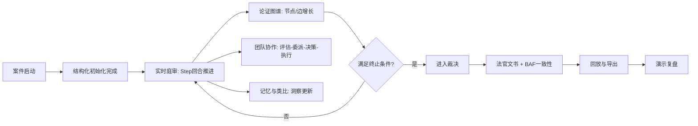
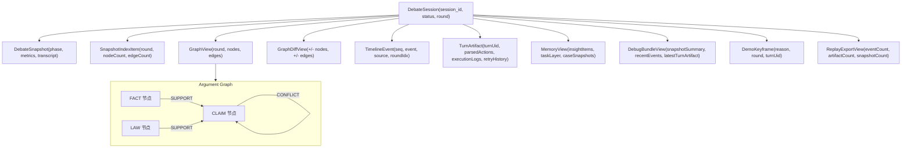
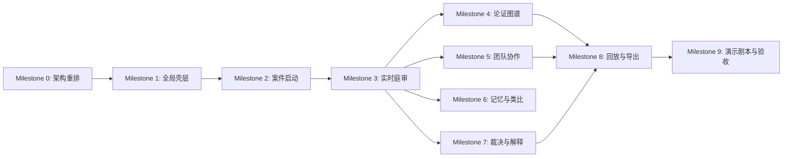

# TODO 路线图（基于 `frontend.md`）

更新时间：2026-02-10  
目标：为后续所有编码工作提供可执行的总体线路，并保证“正常流程在演示中全部可见”。

---

## 当前进度（2026-02-10）

- [x] 完成第一阶段主站重构：`案件启动`、`实时庭审`、`裁决解释` 三页已落地。
- [x] 完成后台调试入口：现有全功能调试台已迁移为 `/admin/debug` 独立入口。
- [x] 完成图先于文的首批实现：实时庭审页论证图、裁决页 BAF 图已直接渲染。
- [x] 修复后台请求刷屏问题：移除 `snapshot -> effect -> snapshot` 循环依赖，消除重复拉取 `snapshot/graph/events` 的异常放大。
- [x] 收敛指标主展示已落地：实时庭审页改为以 `ΔΦ/SMA/阈值` 展示终止进程，`maxRounds` 降级为安全上限说明。
- [x] 论证图力导布局已落地：替换固定分层布局，新增节点筛选、关系筛选、主张邻域聚焦与节点详情联动。

---

## 0. 范围与边界

- 本轮只覆盖正常执行路径的可视化与交互闭环。
- 本轮暂不覆盖：模型未加载、外部服务中断、环境配置错误等异常演示。
- 本轮明确纳入：图操作验证失败后的回滚与重试（这是业务正常流程的一部分）。
- 本轮新增硬约束：凡底层数据是图结构，前端必须直接渲染图，不允许只给 JSON/表格/纯文本替代。

## 0.1 图渲染硬约束（新增）

- [x] 论证图 `GraphView`：必须以节点-边画布渲染（不可仅列表）。
- [ ] 图差异 `GraphDiffView`：必须在图上高亮新增/移除/状态变化（不可仅数字摘要）。
- [ ] 记忆任务层 `TaskLayer`（案例关系图）：必须渲染案例关系图（不可仅 node_count/edge_count）。
- [ ] 指挥者流程（评估-委派-决策-重试）：必须渲染流程图或状态机图（不可仅文字步骤）。
- [x] BAF 结果（首选扩展/冲突关系）：必须在图上标注被选扩展与关键冲突链（不可仅指标数值）。
- [ ] 所有“图渲染区”必须支持节点点击联动详情（右侧或弹层）。

图渲染验收最低标准：

- [ ] 用户不阅读日志，仅看图就能回答“谁支持谁、谁攻击谁、哪步被回滚、最终采纳了什么”。
- [ ] 每个图视图都有图例（颜色/线型/节点状态）。
- [ ] 每个图视图都有最少 2 种交互（缩放、筛选、点击定位、回合切换中的任意两种）。

---

## 1. 一图胜万言：产品主链路图

---

## 2. 一图胜万言：核心数据结构图（图谱 + 会话）

旁注数据（演示侧重点）：

1. 图谱主对象：`GraphView`，演示时优先展示 `nodes/edges/type/status/author`。
2. 回合变化对象：`GraphDiffView`，演示时优先展示 “新增节点/新增边/状态变化/回滚关联节点”。
3. 行为证据对象：`TurnArtifact`，演示时优先展示 `parsedActions + executionLogs + retryHistory`。
4. 裁决解释对象：`DebateSnapshot` 的 `judgment_document/root_claims_status/baf_details`。

---

## 3. 字段看板（实现时对照）

| 对象 | 核心字段 | 必须出现在哪个页面 |
|---|---|---|
| DebateSnapshot | sessionId, phase, round, maxRounds, convergence(deltaPhi/sma/history), termination(reason), winner, metrics | 实时庭审、裁决与解释 |
| GraphNode | id, type, label, status, content, agentId, metadata | 论证图谱 |
| GraphEdge | id, source, target, type, weight, metadata | 论证图谱 |
| GraphDiffView | addedNodeIds, removedNodeIds, addedEdgeIds, removedEdgeIds | 论证图谱、回放与导出 |
| TimelineEvent | seq, event, source, roundIdx, turnUid | 实时庭审、团队协作 |
| TurnArtifact | controllerAssessment, batchInstructions, decisionRaw, parsedActions, executionLogs, retryHistory | 团队协作、论证图谱审计 |
| MemoryView | insightItems, representativeCaseIds, taskLayerNodeCount, taskLayerEdgeCount, caseSnapshots | 记忆与类比 |
| DebugBundleView | snapshotSummary, recentEvents, latestTurnArtifact | 团队协作（高级视图） |
| DemoKeyframe | reason, round, turnUid | 回放与导出、演示复盘 |
| ReplayExportView | eventCount, artifactCount, snapshotCount | 回放与导出 |

---

## 4. 总体编码顺序（依赖图）

---

## 5. Milestone TODOs（详尽任务清单）

## M0. 架构重排与基线准备

- [x] 将 `frontend/src/App.tsx` 的单页巨组件拆分为“页面容器 + 业务模块 + 共享状态”。
- [ ] 建立路由骨架：`frontend/src/pages/*`，至少包含 8 个页面容器。
- [x] 建立共享状态层：`frontend/src/app/state/*`（会话、图谱、时间线、回合跳转）。
- [ ] 建立统一视图模型层：`frontend/src/viewmodels/*`（把 adapter 原始返回整理成页面直接可渲染结构）。
- [ ] 建立统一文案映射：`frontend/src/i18n/labels.ts`（状态、人话术语、图例文案）。
- [x] 保留并复用现有 compat 适配器，不新增并行数据通道。
- [ ] 约束编码原则：所有页面只消费 viewmodel，不直接拼 raw payload。

交付判定：

- [x] `App.tsx` 仅负责路由和全局壳层，不再承担业务渲染细节。
- [x] 所有现有调试能力仍可工作。

---

## M1. 全局壳层（统一用户认知）

- [x] 实现全局顶栏：产品名、会话 ID、运行模式、实时通道状态。
- [x] 实现生命周期进度条：初始化 -> 辩论 -> 待裁决 -> 裁决 -> 学习。
- [x] 实现全局提示条：当前动作、最近警告、最近完成操作。
- [x] 实现全局导航：主站页面切换 + 后台调试入口。
- [ ] 实现全局加载与空态骨架屏组件。
- [x] 统一状态色板与标签：待验证/被采纳/被驳回。

交付判定：

- [ ] 无论停留在哪个页面，用户都能看懂当前处于哪个生命周期阶段。

---

## M2. 案件启动页（入口闭环）

- [x] 新建 `CaseLaunchPage` 页面容器。
- [x] 接入会话列表（`adapter.listSessions`）。
- [x] 接入新建会话（`adapter.createSession`），支持 `maxRounds` 选择。
- [x] 增加“继续会话”能力（从列表点入）。
- [x] 显示启动后初始化摘要（初始节点数、初始边数、初始阶段）。
- [ ] 在此页设置默认演示参数（仅正常路径参数，不引入异常注入）。

交付判定：

- [x] 从 0 到有会话，只需 1 次主操作。
- [x] 创建后自动跳转到实时庭审页。

---

## M3. 实时庭审页（主操作闭环）

- [x] 新建 `LiveTrialPage` 页面容器。
- [x] 接入 `step`、`adjudicate`、`getSnapshot` 三个主操作按钮。
- [x] 展示庭审总览卡：phase/round/maxRounds/winner/metrics。
- [x] 展示收敛卡：`ΔΦ`、`SMA`、收敛阈值与收敛历史轨迹。
- [x] 实现 transcript 增量高亮（只显示本次状态迁移新增内容）。
- [x] 接入 timeline 事件流展示（含来源过滤）。
- [x] 实现事件点击联动（点击事件 -> 跳到对应回合图谱和回合工件）。
- [x] 增加“是否可裁决”的强提示状态灯。

交付判定：

- [ ] 用户可在此页连续推进回合，直到进入待裁决和裁决完成。

---

## M4. 论证图谱页（图胜于文）

- [ ] 新建 `GraphPage` 页面容器。
- [ ] 复用并升级 `GraphDiffPanel` 为页面核心主画布。
- [x] 论证图默认首屏即画布渲染，禁止默认落到文本视图（先在实时庭审页落地）。
- [x] 增加图例常驻区：节点类型、边类型、节点状态、节点归属（已在力导图组件落地）。
- [ ] 接入回合图加载（`getGraphAtRound`）与 Diff 对比（`getGraphDiff`）。
- [ ] 实现焦点模式：全部/变化/变化邻域/回滚相关。
- [ ] 实现链路模式：全部/支持/冲突 + hop 深度。
- [ ] 实现“根主张锚点”快速定位。
- [x] 实现节点点击联动详情：展示节点内容、元数据与关联边数量。
- [ ] 增加图操作审计卡（按回合列出 action + 状态 + 原因）。
- [ ] 明确展示“回滚事件”为正常流程标签，不标为系统异常。

交付判定：

- [ ] 用户能在图上明确看到某回合新增了什么、哪步被回滚、为何被回滚。

---

## M5. 团队协作页（过程可解释）

- [ ] 新建 `TeamFlowPage` 页面容器。
- [ ] 复用 `TeamFlowPanel`，按回合展示流水线阶段。
- [ ] 将流水线阶段渲染为流程图（节点：ASSESS/DELEGATE/WAIT/DECIDE/RETRY/DONE）。
- [ ] 渲染“指挥者 -> 工作者”委派关系图（边上显示任务类型）。
- [ ] 拆分显示区块：评估、指令、决策、执行、重试。
- [ ] 接入 `TurnArtifact` 详情联动（选中 turnUid 展开具体内容）。
- [ ] 增加“问题追踪视图”：某个失败动作从首尝试到修正成功的链路。
- [ ] 复用 `InspectorPanel` 展示 context/decision/narrative 三联视图。
- [ ] 接入 `DebugBundle` 快照刷新能力，作为一键问题快照。

交付判定：

- [ ] 用户能完整回答“这一回合它为什么这么做，失败后怎么修正”。

---

## M6. 记忆与类比页（学习可见）

- [ ] 新建 `MemoryPage` 页面容器。
- [ ] 展示记忆总览：静态历史数、动态法理数、任务层节点/边数。
- [ ] 新增 TaskLayer 关系图画布（案例节点 + 引用连边 + 代表案例高亮）。
- [ ] 展示 `insightItems` 列表：内容、side、linkedRound、代表案例数。
- [ ] 实现“新洞察/保留洞察”分组。
- [ ] 展示代表案例变化 before/after。
- [ ] 展示案例快照时间轴（round -> node/edge count）。
- [ ] 实现“洞察跳转回放”（点洞察跳到 linkedRound）。

交付判定：

- [ ] 用户能看到记忆不是静态文本，而是可追溯到具体回合变化。

---

## M7. 裁决与解释页（结论可信）

- [x] 新建 `JudgmentPage` 页面容器。
- [x] 展示裁决摘要卡：胜方、裁决状态、根主张采纳率。
- [x] 展示法官文书全文与摘要折叠。
- [x] 展示根主张状态明细表。
- [x] 展示 BAF 一致性卡：首选扩展数、选中扩展大小、一致率。
- [x] 新增 BAF 关系图：主张节点 + 冲突/支持边 + 选中扩展节点高亮。
- [x] 展示终止依据：回合上限或收敛触发。
- [ ] 增加人话解释文案：BAF 指标每项对应一句解释。

交付判定：

- [ ] 用户能在同一页拿到“判决是什么 + 为什么”两层信息。

---

## M8. 回放与导出页（复盘闭环）

- [ ] 新建 `ReplayExportPage` 页面容器。
- [ ] 实现 from/to 回合选择。
- [ ] 实现单回合加载与双回合差异对比。
- [ ] 展示关键帧列表（按时间排序）。
- [ ] 新增“关键帧图轨道”：按 round 串联关键帧节点，点击节点触发联动跳转。
- [ ] 实现关键帧点击联动：图谱 + 团队工件 + 时间线定位。
- [ ] 接入导出 `Replay JSON`。
- [ ] 接入导出 `Graph GEXF`。
- [ ] 接入导出 `Debug Bundle`。
- [ ] 导出后展示摘要（事件数/工件数/快照数）。

交付判定：

- [ ] 用户可以重放全流程并导出可交付材料。

---

## M9. 演示剧本与验收（只走正常路径）

- [ ] 编写固定演示剧本（5-8 分钟，单主持人可完整演示）。
- [ ] 剧本步骤固定化：启动 -> 3 次 step -> 图谱 diff -> 团队协作 -> 记忆 -> 裁决 -> 回放导出。
- [ ] 每一步都给“屏幕上可见证据点”清单。
- [ ] 增加“演示导航模式”（下一步提示）。
- [ ] 录制一次完整走查，校对文案与术语。

交付判定：

- [ ] 不依赖解释口播，观众仅看屏幕也能理解流程推进。

---

## 6. 页面级可见性检查清单（Demo 必过）

## 6.1 初始化可见性

- [ ] 看得到会话从“创建”进入“初始化完成”。
- [ ] 看得到初始图谱规模。
- [ ] 看得到生命周期进度第一段点亮。

## 6.2 回合推进可见性

- [ ] 每次 Step 后回合数字变化可见。
- [ ] Transcript 增量可见。
- [ ] Timeline 新事件可见。
- [ ] 图谱新增节点/边可见。

## 6.3 图操作回滚可见性

- [ ] 回滚动作在审计表可见。
- [ ] 回滚原因在执行日志可见。
- [ ] 重试记录在 `retryHistory` 可见。
- [ ] 修正后成功状态可见。

## 6.4 裁决可见性

- [ ] “待裁决 -> 裁决完成”状态切换可见。
- [ ] 法官文书可见。
- [ ] 根主张状态变化可见。
- [ ] BAF 指标可见。

## 6.5 复盘可见性

- [ ] 任意 round 可回放。
- [ ] 任意 keyframe 可跳转。
- [ ] JSON/GEXF 可导出并可见摘要。

## 6.6 图渲染专项检查（新增硬门槛）

- [x] 论证图页：进入页面后 1 秒内可见节点-边画布，不需额外点“展开 JSON”。
- [x] 实时庭审论证图：节点点击后可见右侧详情卡（内容、元数据、关联边）。
- [ ] 团队协作页：可见流程图与委派关系图，而非仅文本列表。
- [ ] 记忆页：可见 TaskLayer 案例关系图，而非仅数量统计。
- [x] 裁决页：可见 BAF 图上高亮的选中扩展，而非仅首选扩展计数。
- [ ] 回放页：可见关键帧图轨道，并支持点击节点联动跳转。
- [ ] 任一图节点点击后，右侧详情卡必须同步更新对应数据。

---

## 7. 代码落位清单（建议文件结构）

- [x] `frontend/src/App.tsx`：仅保留路由和全局壳层。
- [x] `frontend/src/app/pages/LaunchPage.tsx`
- [x] `frontend/src/app/pages/LivePage.tsx`
- [ ] `frontend/src/pages/GraphPage.tsx`
- [ ] `frontend/src/pages/TeamFlowPage.tsx`
- [ ] `frontend/src/pages/MemoryPage.tsx`
- [x] `frontend/src/app/pages/JudgmentPage.tsx`
- [ ] `frontend/src/pages/ReplayExportPage.tsx`
- [ ] `frontend/src/pages/DemoPlaybookPage.tsx`
- [x] `frontend/src/app/state/*`
- [ ] `frontend/src/viewmodels/*`
- [ ] `frontend/src/components/layout/*`
- [ ] `frontend/src/components/cards/*`
- [ ] `frontend/src/components/graph/*`
- [ ] `frontend/src/components/team/*`
- [ ] `frontend/src/components/memory/*`
- [ ] `frontend/src/components/judgment/*`
- [ ] `frontend/src/components/replay/*`

---

## 8. 暂不纳入本轮 TODO（明确排除）

- [ ] 模型未加载等环境错误的演示流程。
- [ ] 离线模式完整能力仿真。
- [ ] 权限系统与多租户隔离。
- [ ] 国际化多语种切换。

---

## 9. 最终完成定义（DoD）

- [ ] 8 个页面均可访问，且均有真实数据渲染。
- [ ] 正常主流程可在 1 次演示中完整走通，不跳页、不补解释也能看懂。
- [ ] 图操作回滚作为正常流程可被完整追踪（动作 -> 回滚 -> 重试 -> 结果）。
- [ ] 裁决结果有文本解释与逻辑一致性指标双证据。
- [ ] 回放和导出全链路可用，导出后有数量摘要可核验。
- [ ] 所有图结构数据在对应页面均为“先图后文”渲染，不存在只靠表格/JSON 的替代实现。
